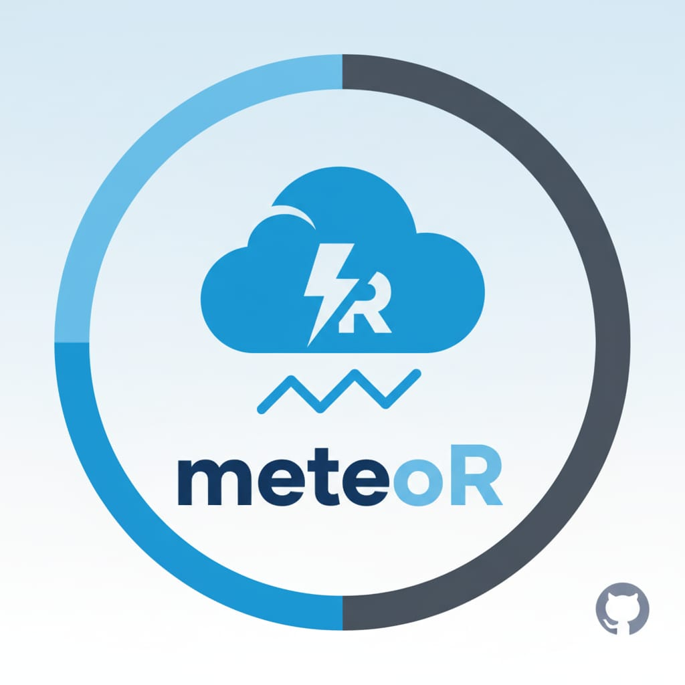

<!-- README.md is generated from README.Rmd. Please edit that file -->

```{r, include = FALSE}
knitr::opts_chunk$set(
  collapse = TRUE,
  comment = "#>",
  fig.path = "man/figures/README-",
  out.width = "100%"
)
```

# meteoR

<!-- badges: start -->

[](https://lifecycle.r-lib.org/articles/stages.html#experimental)

<!-- badges: end -->

## Autores: **Luca Giuffrida, Felipe Widmer**

El objetivo de meteoR es ofrecer un conjunto básico de herramientas para la lectura, organización y visualización de datos meteorológicos, con fines exclusivamente educativos.

## Installation

Podes instalar la version de desarrollo del paquete desde [GitHub](https://github.com/) con:

``` r
# install.packages("pak")
pak::pak("LucaGiu204/meteoR")
```

## Example

Podes leer los datos de estaciones meteorológicas y guardarlas en una ruta especifica con:

```{r example}
library(meteoR)
leer_estacion("NH0472", "datos/NH0472.csv")
```

Luego, podes generar una tabla resumen de temperatura con:

```{r}
tabla_resumen_temperatura(NH0472)
```

Y graficar la temperatura promedio mensual con:

```{r}
grafico_temperatura_mensual(NH0472)
```


## Logo del paquete

