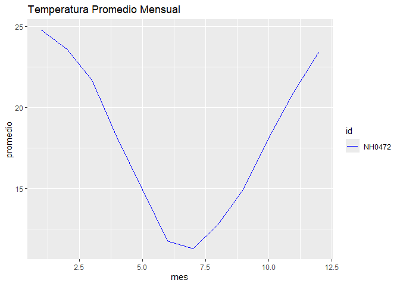

<!-- README.md is generated from README.Rmd. Please edit that file -->

# meteoR

<!-- badges: start -->

[](https://lifecycle.r-lib.org/articles/stages.html#experimental)

<!-- badges: end -->

## Autores: **Luca Giuffrida, Felipe Widmer**

El objetivo de meteoR es ofrecer un conjunto básico de herramientas para
la lectura, organización y visualización de datos meteorológicos, con
fines exclusivamente educativos.

## Installation

Podes instalar la version de desarrollo del paquete desde
[GitHub](https://github.com/) con:

``` r
# install.packages("pak")
pak::pak("LucaGiu204/meteoR")
```

## Example

Podes leer los datos de estaciones meteorológicas y guardarlas en una
ruta especifica con:

``` r
library(meteoR)
leer_estacion("NH0472", "datos/NH0472.csv")
#> el archivo ya existe en esa direccion, leyendo archivo...
#> Rows: 20425 Columns: 35
#> ── Column specification ────────────────────────────────────────────────────────
#> Delimiter: ","
#> chr   (1): id
#> dbl  (18): temperatura_abrigo_150cm, temperatura_abrigo_150cm_maxima, temper...
#> lgl  (15): temperatura_suelo_5cm_media, temperatura_suelo_10cm_media, temper...
#> date  (1): fecha
#> 
#> ℹ Use `spec()` to retrieve the full column specification for this data.
#> ℹ Specify the column types or set `show_col_types = FALSE` to quiet this message.
#> archivo leido correctamente,
#> # A tibble: 20,425 × 35
#>    id     fecha      temperatura_abrigo_150cm temperatura_abrigo_150cm_maxima
#>    <chr>  <date>                        <dbl>                           <dbl>
#>  1 NH0472 1961-07-01                     11.1                            13.4
#>  2 NH0472 1961-07-02                      5.5                            10.5
#>  3 NH0472 1961-07-03                      6                              10.8
#>  4 NH0472 1961-07-04                     NA                              NA  
#>  5 NH0472 1961-07-05                     12.4                            14.8
#>  6 NH0472 1961-07-06                     11                              16.5
#>  7 NH0472 1961-07-07                      7                              10  
#>  8 NH0472 1961-07-08                      5.6                            10  
#>  9 NH0472 1961-07-09                     NA                              NA  
#> 10 NH0472 1961-07-10                      8.4                            12.1
#> # ℹ 20,415 more rows
#> # ℹ 31 more variables: temperatura_abrigo_150cm_minima <dbl>,
#> #   temperatura_intemperie_5cm_minima <dbl>,
#> #   temperatura_intemperie_50cm_minima <dbl>,
#> #   temperatura_suelo_5cm_media <lgl>, temperatura_suelo_10cm_media <lgl>,
#> #   temperatura_inte_5cm <lgl>, temperatura_intemperie_150cm_minima <lgl>,
#> #   humedad_suelo <lgl>, precipitacion_pluviometrica <dbl>, granizo <dbl>, …
```

Luego, podes generar una tabla resumen de temperatura con:

``` r
tabla_resumen_temperatura(NH0472)
#> # A tibble: 2 × 4
#>   maximo minimo estadistica NH0472
#>    <dbl>  <dbl> <chr>        <dbl>
#> 1   42.1     -8 media        18.0 
#> 2   42.1     -8 desvio        8.69
```

Y graficar la temperatura promedio mensual con:

``` r
grafico_temperatura_mensual(NH0472)
```



## Logo del paquete

<figure>

<figcaption aria-hidden="true">Logo del paquete</figcaption>
</figure>
